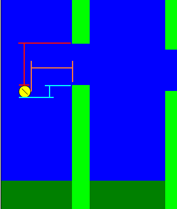
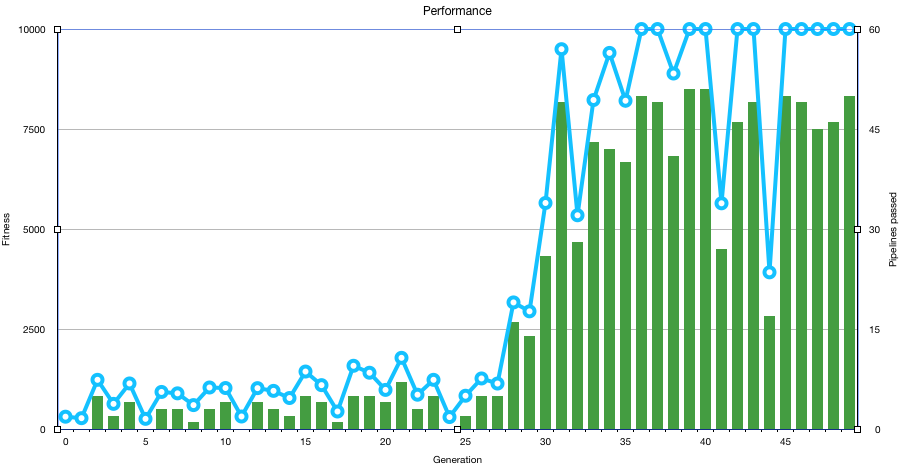
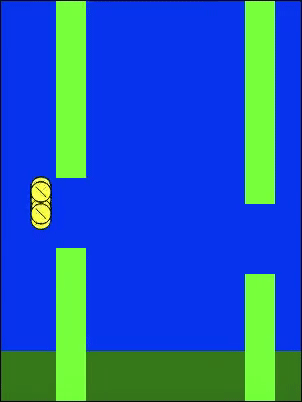

# Flappy Bird AI
**Evolutionary Algorithm: develop an AI to play Flappy Birds**

*Idea*: develop an AI that can fly through the pipelines. The AI needs to decide whether to flap or not to flap. As the interaction of the bird directly has an impact on the environment: the position of the bird and its vertical speed (rising or falling), [Reinforcement Learning](https://en.wikipedia.org/wiki/Reinforcement_learning) is a good fit to develop the AI. 

## Approach
We develop an AI that learns to fly in a Flappy Bird like game. The AI is 'trained' using an [Evolutionary Algorithm](https://en.wikipedia.org/wiki/Evolutionary_algorithm). The idea is taken from biology: a set of randomly generated agents are evaluated via a fitness function. Then the best agents are selected for seeding the next generation: two agents 'mate' and create offspring that shares the traits of it's 'parents'. As in biology the aim is that the best agents give their information to the next generation and thus their 'children' become even better than the parents.

In our setting, the agents are controlled by a 2-layer [feedforward network](https://en.wikipedia.org/wiki/Feedforward_neural_network). The input to the network consists of 5 dimensions: 
* the distance if the birds fron to the next pipe
* the distance of the backside if the bird to the backside of the next pipe (in case the bird is just crossing a pipe)
* the distance to the top pipe (does the bird need to sink)
* the distance to the bottom pipe (does the bird need to raise)
* the vertical speed of the bird (does the bird raise or fall)

<p align="center">
    
</p>

The fitness function used in the Flappy Bird game is **how many frames an agent has survived**. The longer a bird survives the further it got in the game. Another option to measure the fitness of an agent is to count the number of pipes it successfully passed. A drawback that I see with this approach is that any agent not flying through a pair of pipes is rated with 0 points independent of whether the agent did not flap at all and directly fell on the ground, or whether it tried to fly but could not find its way through the opening between the pipes.

After the end of each generation the best individuals are selected:
```(javascript)
getBestBirds(number) {
  var sortedBirds = this.population.slice();
  sortedBirds.sort((bird1, bird2) => bird1.points < bird2.points);
  return sortedBirds.splice(0, number);
}
```

They then serve as *parents* for the next generation. As the behavior of the agents is determined by the weights of the edges in the Neural Network, they are our equivalent to DNA in biological terms. Similar to DNA that is passed to the children by both of its parents, the weights of both parents of a new agent influence the weights of the child bird:

```(javascript)
getChild(parent1, parent2) {
  var parent1Weights = this.getParentBrainWeights(parent1);
  var parent2Weights = this.getParentBrainWeights(parent2);

  // random replacement
  var childWeights = parent1Weights.map((weight, index) => this.randomlySelect(weight, parent2Weights[index]));

  // change weights a little
  var mutatedChildWeights = childWeights.map(weight => weight + getRandom(MIN, MAX));

  return this.childGenerator(mutatedChildWeights);
}
```

There are several options to generate the weights of a *child* based on the wieghts of the *parents*:
* [**Crossing-over**](https://de.wikipedia.org/wiki/Crossing-over): take the weights of parent 1 until a randomply chosen point, after that take the weights of parent 2.
* **Randomly selected weights**: for each position of weights take either the weight of either of the two parents. It is similar to multiple crossing-overs of the weights.

In addition to merging the parents weights into a single set of weights, we randomly mutate each weight a little. This helps to prevent that the algorithm gets stuck in a local maximum.

## Evolution of the Agent
The initial population of agents has randomly created weights. Thus the agents behave completely random in the environment. Some birds still will perform better than others by being 'lucky'. These birds then pass their weights dow to the next generation and thus create offspring that inherits it's parents traits. If a bird by luck steers through the opening in the pipes and thus survives longer than others, it passes the information that steering through the opening is beneficial to its offspring.

<p align="center">
    
</p>

Over 50 generations, the agents become increasingly better: the first generations survive a few pipes only, but after a while through random mutations, an agent was created that took the right decisions to steer through the pipes. This agent then is used as parent for future generations. 

Our setting has a population of 100 agents per generation and the 10 best are chosen as parents for the next generation.

**The final generation of birds finally is able to master Flappy Birds!**

<p align="center">
    
</p>

## Future plans:
* try other approaches to create the weights of offspring: 
  * crossing-over
  * limiting mutations to x% of the weights instead of all
* change parameters of the model to make the evolution more stable, in the current setting there can be cases where no good agents evolve
* compare the evolutionary algorithm to a [Q-learning approach](https://towardsdatascience.com/a-beginners-guide-to-q-learning-c3e2a30a653c). Q-learning uses Stochastic Gradient to change the weights of the neural network which is a more direct approach compared to the random mutations.